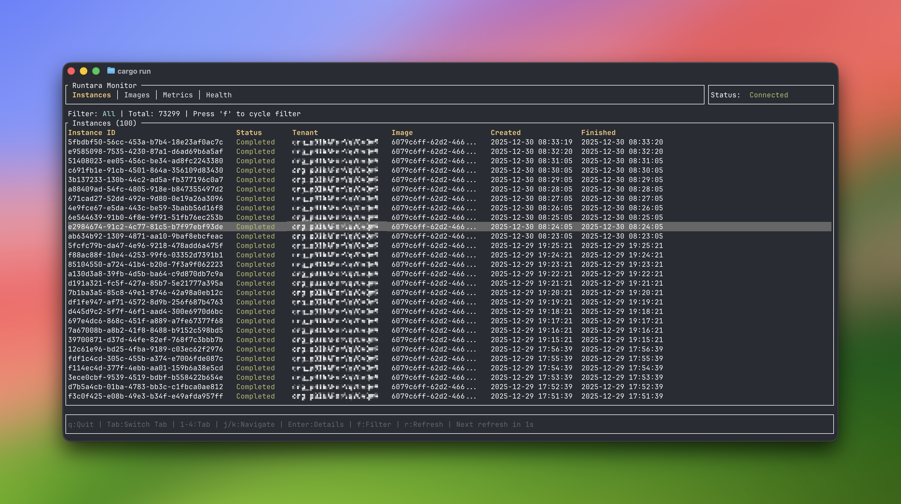

# Runtara TUI

A terminal-based monitoring interface for the [Runtara](https://github.com/runtara/runtara) durable execution platform.


## Overview

Runtara TUI provides real-time visibility into your Runtara deployment through an interactive terminal dashboard. Monitor workflow instances, inspect checkpoints, view performance metrics, and check system health—all from your terminal.



## Features

- **Instance Monitoring** - Track workflow executions with status filtering (Running, Completed, Failed, Pending, Suspended)
- **Checkpoint Inspector** - Drill into instance checkpoints and view serialized state data
- **Image Registry** - Browse registered container images and their metadata
- **Performance Metrics** - View invocation counts, success rates, and timing statistics per tenant
- **Health Dashboard** - Monitor service status, version, uptime, and active instance count
- **Auto-Refresh** - Configurable refresh interval with countdown indicator
- **Keyboard-Driven** - Efficient navigation without leaving the terminal

## Installation

### From Source

```bash
git clone https://github.com/runtara/runtara-tui.git
cd runtara-tui
cargo build --release
```

The binary will be available at `target/release/runtara-tui`.

### Prerequisites

- Rust 1.75 or later
- A running `runtara-environment` server (default port: 8002)

## Usage

```bash
# Connect to local server (default)
runtara-tui

# Connect to remote server
runtara-tui --server 192.168.1.100:8002

# Specify tenant for metrics
runtara-tui --tenant my-tenant-id

# Custom refresh interval (seconds)
runtara-tui --refresh 10

# Disable TLS certificate verification
runtara-tui --skip-cert-verification
```

### Environment Variables

| Variable | Description | Default |
|----------|-------------|---------|
| `RUNTARA_ENV_ADDR` | Server address | `127.0.0.1:8002` |
| `RUNTARA_SKIP_CERT_VERIFICATION` | Skip TLS verification | `true` |

## Keyboard Shortcuts

### Global

| Key | Action |
|-----|--------|
| `q` / `Esc` | Quit (or go back in detail views) |
| `Tab` | Next tab |
| `Shift+Tab` | Previous tab |
| `1`-`4` | Jump to tab |
| `r` | Refresh data |

### List Navigation

| Key | Action |
|-----|--------|
| `j` / `↓` | Move down |
| `k` / `↑` | Move up |
| `Enter` | Open detail (Instances tab) |
| `f` | Cycle status filter (Instances tab) |
| `g` | Toggle granularity (Metrics tab) |

### Detail Views

| Key | Action |
|-----|--------|
| `Esc` | Go back |
| `j` / `k` | Scroll content |
| `c` | View checkpoints (Instance detail) |
| `Enter` | View checkpoint data (Checkpoints list) |

## Tabs

### Instances

Lists all workflow instances with their:
- Status (color-coded)
- Tenant ID
- Image name
- Creation timestamp
- Last update

Press `Enter` to view instance details including input/output data and errors. From the detail view, press `c` to inspect checkpoints.

### Images

Displays registered container images with:
- Image name and tag
- Tenant ID
- Runner type
- Creation date

### Metrics

Shows performance statistics per tenant (requires `--tenant` flag):
- Time bucket (hourly/daily, toggle with `g`)
- Total invocations
- Success/failure counts
- Success rate (color-coded)
- Average/max execution time

### Health

Displays system status:
- Service version
- Uptime
- Active instance count
- Connection status

## Architecture

```
src/
├── main.rs   # Terminal setup, event loop, keyboard handling
├── app.rs    # Application state, SDK interactions, data fetching
└── ui.rs     # Ratatui rendering (tabs, tables, modals)
```

The TUI connects to `runtara-environment` via QUIC protocol using the `runtara-management-sdk`. Data is fetched on startup and refreshed automatically based on the configured interval.

## Dependencies

- [ratatui](https://github.com/ratatui-org/ratatui) - Terminal UI framework
- [crossterm](https://github.com/crossterm-rs/crossterm) - Terminal I/O
- [tokio](https://tokio.rs) - Async runtime
- [runtara-management-sdk](https://github.com/runtara/runtara) - QUIC client for runtara-environment

## License

AGPL v3 License - see [LICENSE](LICENSE) for details.
